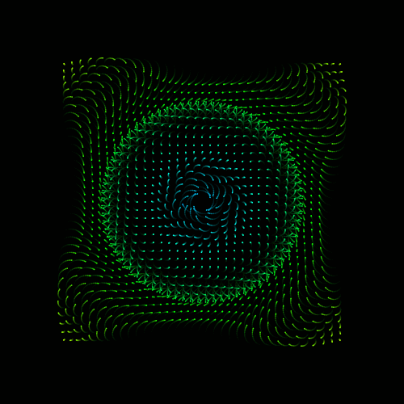

<h1 align="center">Hi 👋, I'm Padmaraj Harigal Padmaraj Harigal</h1>
<h3 align="center">A Python/c Practitioner</h3>

  

- 🔭 I’m studying **Electronics and communication**

- 🌱 I’m currently learning **B.E**

- 👯 I’m looking to collaborate on [Ethical Hacking](https://education.nikist.in/s/mycourses)

- 🤝 I’m looking for a help with **Cybersecurity**

- 👨‍💻 All of my projects are available at [https://github.com/MARSHALL-exee](https://github.com/MARSHALL-exee)

- 💬 Ask me about **Python and c**

- 📫 How to reach me **https://www.instagram.com/marshall_exee?igsh=MXQ4NXAyMzlvc2w4aA==**

- ⚡ Fun fact **I always go for logistics**

<h3 align="left">Connect with me:</h3>

<h3 align="left">Languages and Tools:</h3>

    

&nbsp;

